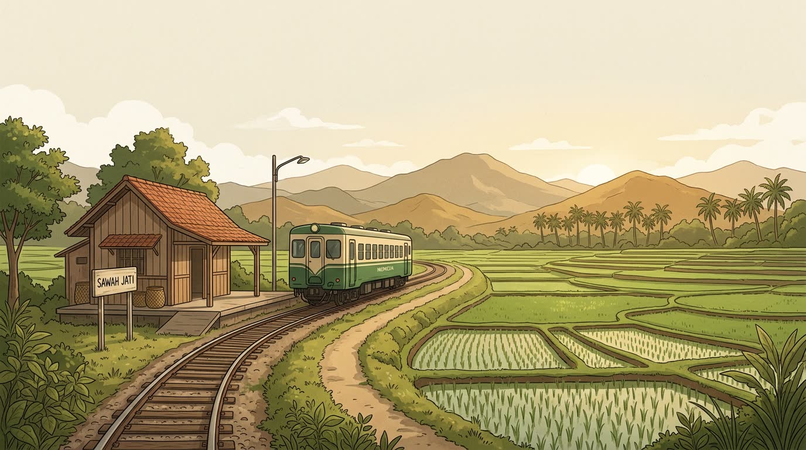
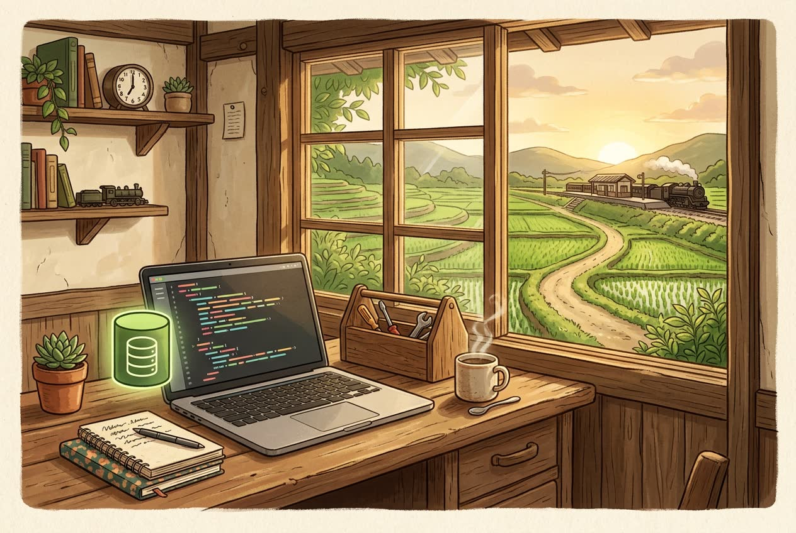
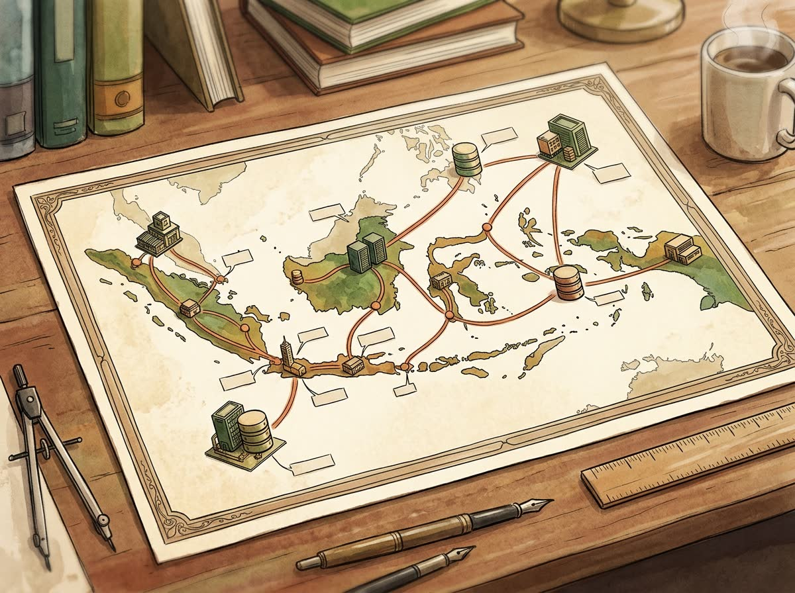
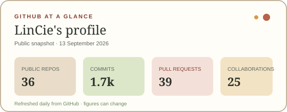
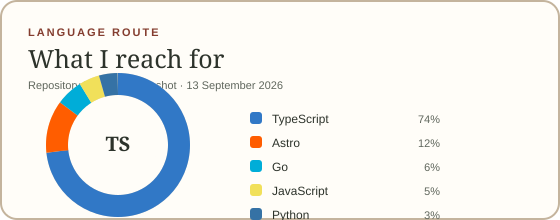

# LinCie

<p align="center">
  
</p>

<p align="center">
  
</p>

<p align="center">
  <strong>Software engineering trainee · Backend engineer · Creative developer</strong><br />
  I build dependable systems and thoughtful digital experiences from Indonesia.
</p>

<p align="center">
  <a href="https://lincie.me">Website</a> ·
  <a href="https://lincie.me/projects/">Projects</a> ·
  <a href="https://lincie.me/thoughts/">Notes</a> ·
  <a href="mailto:contact@lincie.me">Email</a> ·
  <a href="https://github.com/lincie">GitHub</a>
</p>

## Hello from the station

I’m **LinCie**, a software engineering trainee at **Sea Labs Indonesia (Shopee)**. I work mostly on backend services in **Go** and **TypeScript**, with a focus on PostgreSQL, API design, query performance, and systems that stay understandable after they ship.

My route into engineering began with a degree in **Marketing Management and Business Administration**. That background still shapes how I build: technical decisions should have a human and operational reason behind them. A faster query gives someone time back; a clear API gives another person a system they can safely maintain.

Before Sea Labs, I was a Full Stack Engineer at **PT Haebot Teknologi Indonesia**, where I led the rewrite of a core ERP system and reduced production query latency from approximately **2.5 seconds to under 400 milliseconds**.

> I believe in quiet craft: measure first, prefer predictable solutions, and build software that reliably serves the people depending on it.

<p align="center">
  
</p>

## What I build

- **Backend & systems** — Go and TypeScript services, REST/gRPC APIs, business logic, and integrations.
- **Data foundations** — PostgreSQL schemas, transactions, indexes, query-plan analysis, and type-safe database access with Kysely.
- **Production tooling** — Docker-based environments, resilient services, storage workflows, and practical automation.
- **Crafted websites** — Fast, accessible, SEO-conscious experiences with Astro, Tailwind CSS, TypeScript, and carefully used motion.

<p align="center">
  
</p>

## Selected work

- **[Bearuang](https://lincie.me/projects/bearuang/)** — A modular POS and ERP backend for retail workflows.  
  `30+ REST endpoints` · `2,000+ req/min` · `1M+ seeded products`
- **[Haebot ERP Rewrite](https://lincie.me/projects/haebot-erp/)** — A ground-up enterprise ERP rewrite for Sales, Inventory, and Finance.  
  `>84% lower query latency` · `~1 hour → <5 minutes setup` · `25 employees served`
- **[Lintas Nusa Logistics](https://lincie.me/projects/lintas-nusa/)** — An enterprise logistics platform with an interactive national network map.  
  `5 core pages` · `9-node SVG map` · `Astro · GSAP · Tailwind CSS`
- **[Mika Discord Music Bot](https://lincie.me/projects/mika/)** — A production music bot with normalized multi-source audio streaming.  
  `2+ years running` · `6 servers` · `1,000+ community members`

[Explore all projects →](https://lincie.me/projects/)

## Toolkit

<div align="center">
  
  
  
  
  
  
  
  
  
  
</div>

## GitHub in pictures

<p align="center">
  <picture>
    <source media="(prefers-color-scheme: dark)" srcset="./profile/github-stats-dark.svg" />
    
  </picture>
  <picture>
    <source media="(prefers-color-scheme: dark)" srcset="./profile/top-languages-dark.svg" />
    
  </picture>
</p>

<p align="center">
  <picture>
    <source media="(prefers-color-scheme: dark)" srcset="./profile/github-snake-dark.svg" />
    
  </picture>
</p>

These cards and the contribution illustration are stored in this repository and refreshed daily by [`.github/workflows/profile-visuals.yml`](./.github/workflows/profile-visuals.yml). They do not depend on a live public image endpoint, which keeps the profile visual without repeating the broken deployment problem.

## This repository

This repository, **[`lincie/lincie`](https://github.com/lincie/lincie)**, is the source for [LinCie Station](https://lincie.me): a personal portfolio, project archive, and small home for engineering notes.

The site is a mostly static Astro experience with data-driven pages, accessible navigation, responsive layouts, SEO metadata, structured data, and small, purposeful animations.

<details>
<summary><strong>Run it locally</strong></summary>

**Requirements:** [Bun](https://bun.sh) and Node.js `>=22.12.0`.

```bash
git clone https://github.com/lincie/lincie.git
cd lincie
bun install
bun run dev
```

Useful commands:

```bash
bun run build    # Create a production build
bun run preview  # Preview the production build
bun run format   # Format source files
bun run lint     # Lint source files
bun run check    # Run Astro checks
```

</details>

---

<sub>Built with Astro, Tailwind CSS, TypeScript, and a little GSAP. No tracking, no hurry.</sub>
